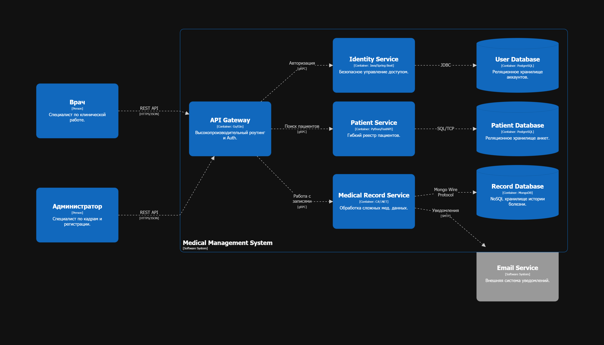
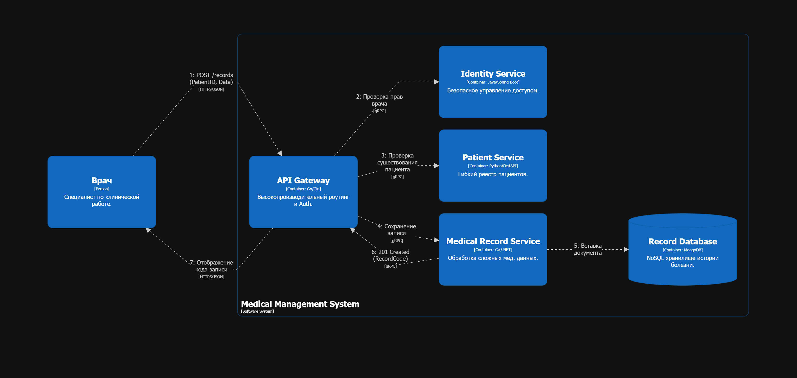

# Домашнее задание 01: Документирование архитектуры в Structurizr

## 1. Вариант 20
Система представляет собой платформу для управления медицинскими данными (аналог Epic). Основная задача — обеспечить безопасное хранение персональных данных пациентов, строгое управление доступом персонала и ведение гибкой истории медицинских записей.

## 2. Роли пользователей (персонала) и внешние системы
* **Администратор:** Ответственен за управление учетными записями персонала и первичную регистрацию пациентов.
* **Врач:** Осуществляет поиск пациентов, формирует медицинские записи, изучает историю болезни и находит записи по кодам.
* **Email Service:** Внешняя система для автоматической рассылки уведомлений об изменениях в медицинской карте.

## 3. Технологический стек и обоснование
В архитектуре используются различные технологии в зависимости от специфики и задачи определённого модуля:

| Контейнер | Технология | Обоснование |
| :--- | :--- | :--- |
| **API Gateway** | Go (Gin) | Минимальные задержки при маршрутизации и высокая пропускная способность. |
| **Identity Service** | Java (Spring Boot) | Обеспечение безопасности (Spring Security) для авторизации и работы персонала. |
| **Patient Service** | Python (FastAPI) | Высокая скорость разработки CRUD-интерфейсов и гибкость обработки анкетных данных. |
| **Medical Record Service** | C# (.NET) | Производительность и хорошая поддержка NoSQL решений. |
| **User/Patient DB** | PostgreSQL | Классический выбор для реляционной базы данных. |
| **Record DB** | MongoDB | Документоориентированная модель для хранения записей с переменной структурой (JSON). |

## 4. Взаимодействие контейнеров
* **Внешний интерфейс:** Клиентские приложения взаимодействуют с системой через **REST API** (API Gateway).
* **Внутренний интерфейс:** Микросервисы общаются между собой по протоколу **gRPC**.
* **Базы данных:** Каждый сервис владеет собственной базой данных, доступ к которой осуществляется по соответствующим протоколам (JDBC, SQL/TCP, Mongo Wire).

## 5. Основные сценарии взаимодействия

### Создание медицинской записи (Dynamic Scenario)
1. **Врач** отправляет запрос `POST /records` с данными пациента на **API Gateway**.
2. **API Gateway** проверяет права врача через **Identity Service**.
3. **API Gateway** валидирует существование пациента через запрос к **Patient Service**.
4. **Medical Record Service** сохраняет запись в **MongoDB** и генерирует уникальный код.
5. Результат возвращается врачу, а система инициирует уведомление через **Email Service**.

## 6. Перечень API
* `POST /users` — Создание нового пользователя (сотрудника)
* `GET /users/{login}` — Поиск пользователя (сотрудника) по логину
* `GET /users/search?mask={mask}` — Поиск пользователя (сотрудника) по маске имя и фамилии
* `POST /patients` — Регистрация пациента
* `GET /patients/search?fio={fio}` — Поиск пациента по ФИО
* `POST /records` — Создание медицинской записи
* `PATCH /patients/{id}/records` — Добавление записи к пациенту
* `GET /patients/{id}/history` — Получение истории записей пациента
* `GET /records/{code}` — Получение записи по коду